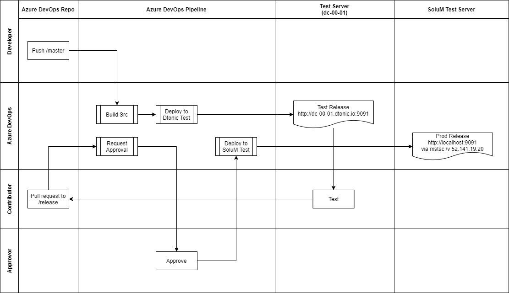

[[_TOC_]]

# Test 환경
## dtonic test 환경
- AIMS(Server, Cloud) Dev branch URL: dc-00-01.dtonic.io:9091
- AIMS_Server QA branch URL: dc-00-01.dtonic.io:1022
- AIMS_Cloud Dev branch URL: dc-00-01.dtonic.io:9444

## SoluM test 환경
- Test 서버 접속
  - url: 52.141.19.20
  - account: solum / solum.dashboard.2020!
  ```
  mstsc /v 52.141.19.20
  ```
- test server path
C:\Program Files\AIMS\util\was\apache-tomcat-8.5.34\webapps

# deploy pipeline



## Pull request
- Azure > Repos > Pull requests로 이동
- **New pull request** 버튼 클릭
- **master** into **release** 로 선택
- 내용 입력 후 **Create**

## Approval
- Azure > Repos > Pull requests로 이동
- 승인 할 request 선택
- 내용을 보고 승인 할 경우 
  - **Approve** 선택 후 **Complete** 선택
  - Merge type은 **Rebase and fast-forward** 선택
  - Complete merge를 선택
- 승인을 안 할 경우 
  - **Reject** 선택 후 **Abandon** 선택