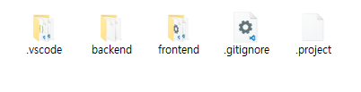

[[_TOC_]]

# 기본 설정

## Directory 설정
- Spring backend를 backend 폴더, Vue frontend를 frontend라고 할때 아래와 같이 같은 위치에 Folder를 위치시킴



## build
- Spring boot에 Vue를 포함하여 jar / war를 생성하기 위해서는 vue의 compile 결과가 target/classes/static에 위치하여야 함
- 따라서 빌드 순서는 아래와 같이 진행
 - Vue frontend build
 - output을 target/classes/static
 - Spring backend build
 
## 실행 스크립트
- build 환경이 Server Version과 Cloud Version으로 구분되어 있어 각각 빌드 필요
- 각각의 환경에 따른 환경 변수는 /frontend/.env.cloud 와 /frontend/.env.server에 추가 가능

### Server
```name=package-server.cmd
set FRONTEND_PATH=frontend
set BACKEND_PATH=backend
pushd
cd .\%BACKEND_PATH%
cmd /s /c "call .\mvnw clean" || exit /b
cmd /s /c "call mkdir target\classes\static"

cd ..\%FRONTEND_PATH%
cmd /s /c "call npm run build -- --dest ../%BACKEND_PATH%/target/classes/static" || exit /b

cd ..\%BACKEND_PATH%
cmd /s /c "call .\mvnw package"

popd
```

### Cloud
```name=package-server.cmd
set FRONTEND_PATH=frontend
set BACKEND_PATH=backend
pushd
cd .\%BACKEND_PATH%
cmd /s /c "call .\mvnw clean" || exit /b
cmd /s /c "call mkdir target\classes\static"

cd ..\%FRONTEND_PATH%
cmd /s /c "call npm run build-cloud -- --dest ../%BACKEND_PATH%/target/classes/static" || exit /b

cd ..\%BACKEND_PATH%
cmd /s /c "call .\mvnw package"

popd
```

## error Handling용 Controller 추가
- 404 등 error 페이지를 표시가 필요할 경우 server에서 error page를 표시하거나, Vue쪽으로 전환을 시켜주어야 함
- Vue쪽으로 전환이 필요할 경우 Spring 서버에 아래와 같은 ErrorController 추가가 필요함
```name=ErrorController.java, lang=java

import javax.servlet.http.HttpServletRequest;

import org.springframework.boot.web.servlet.debug.debugController;
import org.springframework.stereotype.Controller;
import org.springframework.web.bind.annotation.RequestMapping;

/**
 * RootController
 */
@Controller
public class RootController implements ErrorController {
    @RequestMapping("/error")
    public String redirectRoot(HttpServletRequest request){
        return "forward:/index.html";
    }
  
    @Override
    public String getErrorPath() {    
        return "/error";
    }
}
```

# Test용 Tomcat 설정
## Tomcat의 Context를 적용
- env.VUE_PUBLIC_PATH 를 추가
- 기본 build는 .env.server이므로 해당 파일
```name=.env.server
VUE_APP_PRODUCTION_TYPE='server'
VUE_PUBLIC_PATH=/Dashboard
```

## Tomcat webapps에 배포할 경우
- 해당 Context에 맞게 변경하여 dist 폴더를 Dashboard[Context명]으로 webapps에 복사

## Tomcat webapps에 이외에 배포할 경우
- $tomcat_dir/conf/server.xml의 HOST에 아래 내용 추가
```
<Host>
    <Context path="/dashboard" override="true" docBase="/deploy/dashboard" reloadable="false" />
</Host>
```